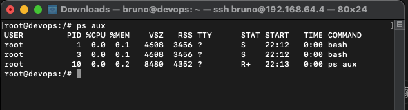

### Linuxtips
# Estudo sobre git, docker e Kubernetes

Indice do arquivo
[ ] CRIAR INDICE

## Introdução
Container é uma tecnologia de virtualização leve usada principalmente para empacotar e isolar aplicativos e suas dependências em um ambiente separado, também podemos dizer que container é o agrupamento de uma aplicação junto com as suas dependências que compartilham o kernel do sistema operacional do host. Em outras palavras container é uma forma de isolamento.

A seguir, na figura, podemos notar as diferenças de quando temos aplicações sendo executadas nativamente, máquinas virtuais e por fim em containers.


Containeres são muito populares porque oferecem várias vantagens, entre elas vale destacar:

1. Portabilidade: Como cada container inclui todas as dependências que ele precisa para a aplicação rodar perfeitamente, da mesma maneira em diversos ambientes sem problemas de compatibilidade.
2. Leveza: Por não precisarem de um sistema operacional completo consumem menos recursos.
3. Escalabilidade: São fáceis de replicar e escalar em diversos ambientes.
4. Rapidez: Se comparado a uma VM comum, a inicialização de um container é extremente rápida.

Observando a imagem acima pode então chegar a conclusão que a principal diferença entre uma VM (Máquina virtual) e um container é que na VM a máquina é virtualizada por inteiro até as camadas de hardware, enquanto que os contêineres a virtualização é apenas das camadas de software que estão acima da camada de sistema operacional.

Antes de continuarmos é necessário entender alguns conceitos importantes.

1. **Cgroups:** São uma funcionalidade do kernel Linux que permite gerenciar e limitar os recursos que os processos de um sistema podem consumir. 
2. **Namespaces:** São funcionalidades do kernel Linux usada em conjunto com o cgroup para prover isolamento de processos. Enquanto os cgroups controlam o uso de recursos (CPU, Memória, etc.), os namespaces são responsáveis por isolar diferentes aspectos do ambiente de execução, como isolamento do FileSystem, interfaces de rede, usuários, processos e etc. Em outras palavras, namespaces criam "subconjuntos" isolados de recursos do sistema, de modo que os processos em diferentes namespaces acreditem estar rodando em sistemas separados, embora compartilhem o mesmo kernel.

## Isolando recursos.
Antes de nos aprofundar no mundo dos containeres, vamos aprender a isolar um ambiente para entender melhor os conceitos acima apresentados.

#### Requisitos

1. Um sistema Linux, no nosso estudo estou usando debian
2. Permissão de superusuário
3. Pacotes necessários: debootstrap e cgroups-tools

Devemos acessar nosso servidor Linux e instalar os pacotes necessários

1. Antes de mais nada, devemos atualizar a lista de pacotes do nosso repositório
`````
apt-get update
`````

2. Instalação dos pacotes necessários
````
apt-get install debootstrap cgroups-tools
````

3. Agora vamos baixar e instalar em nosso servidor uma base mínima de um sistema Debian no diretório /mnt/ambiente_isolado
````
sudo debootstrap stable /mnt/ambiente_isolado http://deb.debian.org/debian
````
Onde:
* Stable: Nome da distribuição que deseja-se instalar.
* /mnt/ambiente_isolado: Caminho onde o ambinte será montado.
* http://deb.debian.org/debian: Url do repositório Debian.

4. Pacotes e configurações iniciais finalizadas, vamos criar um novo cgroup com o nome ***ambiente_isolado*** e limitar o uso de cpu em 10%.
`````
sudo cgcreate -g cpu:/ambiente_isolado

echo "10000" | sudo tee /sys/fs/cgroup/cpu/ambiente_isolado/cpu.cfs_quota_us
`````
Observação:

* ***cpu.cfs_period_us:*** Define o período de tempo (em microssegundos) que o kernel considera como um "ciclo" de uso de CPU. O padrão é 100 mil microssegundos (100 milisegundos), o que equivale a 1 CPU por ciclo completo.

* ***cpu.cfs_quota_us:*** Define o tempo máximo de CPU que o cgroup pode usar durante um período (cpu.cfs_period_us).

5. Chegou a hora de montar nosso ambiente, isolando os recursos de filesystem, processos e usuários da máquina host.
````
sudo cgexec -g cpu:ambiente-isolado unshare --mount --uts --ipc --map-root-user --user --pid --fork chroot /mnt/ambiente_isolado bash
````
O comando acima cria um novo ambiente isolado utilizando namespaces e o chroot, iniciando um shell (bash) dentro de um diretório especifíco (/mnt/ambiente_isolado), uma descrição detalhada de cada opção encontra-se abaixo.

Desbravando o comando acima:
* ***unshare:*** Esse comando é usado para "desvincular" (unshare) um ou mais namespaces do processo atual, permitindo a criação de um novo ambiente isolado. Ele cria um novo namespace para os recursos especificados, garantindo que eles não sejam compartilhados com o sistema original.

* ***--mount:*** Cria um novo mount namespace, isolando os pontos de montagem. Com isso, qualquer alteração nos pontos de montagem (montar ou desmontar sistemas de arquivos) feita dentro do namespace não afetará o sistema de arquivos do host.

* ***--uts:*** Cria um novo UTS namespace, que isola o nome do host e do domínio. Isso permite que o ambiente isolado tenha seu próprio hostname, independente do sistema principal.

* ***--ipc:*** Cria um novo IPC namespace, que isola os mecanismos de comunicação entre processos, como filas de mensagens e memória compartilhada, garantindo que os processos dentro do ambiente isolado não possam interagir com os processos externos usando esses mecanismos.

* ***---map-root-user:**** Mapeia o usuário root dentro do user namespace recém-criado. Isso significa que o usuário dentro do namespace isolado terá privilégios de root, mas sem ter os mesmos privilégios fora dele. É útil para rodar processos com permissões elevadas dentro do ambiente isolado, mas sem comprometer a segurança do sistema host.

* ***--user:*** Cria um novo user namespace, isolando IDs de usuários e grupos. Com isso, os IDs de usuários e grupos dentro do namespace são diferentes dos do sistema host, permitindo, por exemplo, que um processo dentro do namespace tenha o ID de root (0), mas sem os mesmos privilégios fora do namespace.

* ***--pid:*** Cria um novo PID namespace, isolando a árvore de processos. Os processos dentro deste namespace terão seus próprios IDs de processo (PIDs) e não poderão ver ou interagir com os processos do host.

* ***--fork:*** Faz com que o unshare crie e execute um novo processo dentro do ambiente isolado. Sem --fork, o processo atual seria modificado para rodar no novo namespace; com --fork, é criado um novo processo isolado.

* ***chroot:*** O comando chroot altera o diretório raiz para /mnt/ambiente_isolado, criando uma visão limitada do sistema de arquivos para os processos. Dentro desse ambiente, os processos só terão acesso aos arquivos contidos em /mnt/ambiente_isolado.

* ***bash:*** Após a criação do ambiente isolado com chroot, o comando bash é executado, iniciando um shell dentro do novo ambiente. Isso permite que você interaja com o sistema isolado a partir do shell.

Em resumo O comando está criando um ambiente completamente isolado em termos de sistema de arquivos, processos, comunicação entre processos, nome do host e mapeamento de usuários

Podemos digitar o comando abaixo para observar que nosso ambiente esta isolado e possui seus próprios processos e filesystem.
````
ps - ef
````


## [Docker](https://www.docker.com/)

Docker é uma plataforma que permite criar, implantar e executar aplicações em ambientes isolados chamados de containeres. Esses containeres empacotam o código de uma aplicação e todas as suas dependêncais, garantindo que a aplicação funcione de maneira consistente, independente do ambiente onde será executada.

### Conceitos principais do Docker:
* ***Imagem (Image):*** É um pacote leve, executável e imutável que contém tudo o que é necessário para rodar uma aplicação, incluindo o código, bibliotecas, dependências e o sistema operacional necessário. As imagens são baseadas em camadas, e é possível construir imagens personalizadas a partir de outras já existentes.

* ***Container:*** É uma instância de uma imagem em execução, contendo a aplicação e suas dependências isoladas do sistema host. Ao contrário de máquinas virtuais, containers compartilham o kernel do sistema operacional, o que os torna muito mais leves e eficientes.

* ***Dockerfile:*** Um arquivo de texto que contém uma lista de comandos necessários para construir uma imagem Docker. Cada linha representa uma instrução que o Docker executa para construir a imagem.

* ***Registro (Registry):*** Um local onde as imagens Docker são armazenadas e compartilhadas, como o Docker Hub, onde é possível encontrar imagens de várias aplicações populares.

### Vantagens do Docker:
* ***Consistência:*** Como os containers encapsulam tudo que a aplicação precisa para rodar, eles evitam problemas de compatibilidade entre ambientes.
* ***Portabilidade:*** Um container Docker pode rodar em qualquer máquina com o Docker instalado, seja local, em um servidor ou em nuvem.
* ***Isolamento e eficiência:*** Containers são mais leves e rápidos do que máquinas virtuais porque compartilham o mesmo sistema operacional, reduzindo o uso de recursos.

Agora que já sabemos o que é o docker vamos colocar a mão na massa

1. Instalando o docker engine
````
sudo curl -fsSl https://get.docker.com | bash
````
2. Executando nosso primeiro container
````
docker container run hello-world
````
3. Verificando se o container esta em execução
````
docker container ls
````
No exemplo anterior, estamos executando um container utilizando a imagem personalizada do hello-world.
Apesar de ser uma tarefa simples, quando você executou o comando "docker container run hello-world" foram necessárias quatro etapas para sua conclusão, vamos ver quais:
* O comando "docker" se comunica com o daemon do Docker informando a ação desejada.
* O daemon do Docker verifica se a imagem "hello-world" existe em seu host; caso ainda não, o Docker faz o download da imagem diretamente do Docker Hub.
* O daemon do Docker cria um novo container utilizando a imagem que você acabou de baixar.
* O daemon do Docker envia a saída para o comando "docker", que imprime a mensagem em seu terminal.

4. Verificando nossas images
````
docker image ls
````
